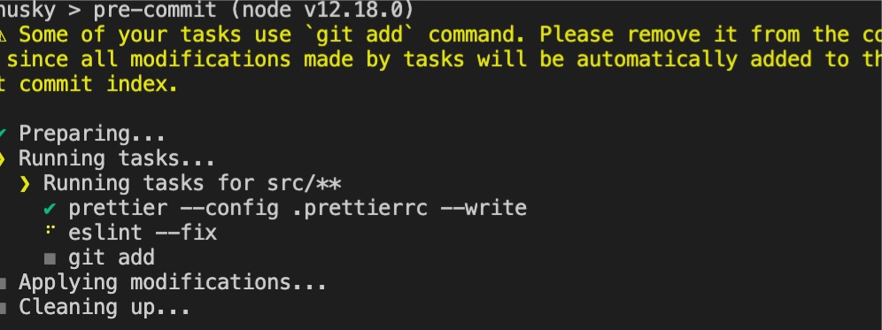

#  eslint自动校验/修复
代码规范是团队开发永远的话题，任务的去宣导和推行远没有实用工具强制执行来的实在。即使实在webpack中配置了eslint校验，依然有那么一部分人会无视控制台几百行的warning,强行提交代码。有人说直接在webpack中配置 ***overlay: true*** 不就行了。好吧，是个办法，但是也确实很影响效率。对于还没有习惯规范化开发的同事来说呢，更是影响开发效率。

那么一切的方法都是为了提升效率，我们需要考虑的就是在不影响我们开发效率的情况下还能做到代码的统一规范。

## 准备工作
首先我们来安装一下所必须的依赖
- husky git的钩子插件，在git的hook中执行一些命令 [git husk 文档](https://www.cnblogs.com/jiaoshou/p/12222665.html)
- lint-staged git暂存文件上运行linters的工具, 对git暂存区的文件进行lint检查 [lint-staged 文档](https://www.cnblogs.com/jiaoshou/p/12250278.html)
- eslint 代码检测工具，一般都项目初始化的时候都已经安装了 [standard 规则文档](https://standardjs.com/rules-zhcn.html)

> yarn add husky lint-staged eslint -D

## 配置eslint rules
在项目根目录下创建eslint 配置文件.esintrc.js;
```js
module.exports = {
    // 设置当前项目根路径为最顶级路径，eslint检索范围不会超出该项目
    root: true,
    // 指定代码执行环境
    env: {
        browser: true
    },
    // 此项是用来提供插件的，插件名称省略了eslint-plugin-，下面这个配置是用来规范html的
    plugins: [
        'vue'
    ],
    // 拓展配置文件，eslint 将按照拓展配置文件的规则来进行规则校验
    // 'plugin:vue/essential' vue的代码格式规则配置插件
    // 'standard' js代码格式规则配置插件，一般项目初始化的时候会询问是否需要配置eslint校验，如果需要会让你选择一种校验规则，我这里使用的是standard
    extends: ['plugin:vue/essential', 'standard'],
    // 规则自定义
    // 重写standard的默认规则，rules内容会覆盖默认的规则，让你的校验规则更加符合自己的开发习惯
    rules: {
        'no-console': process.env.NODE_ENV === 'production' ? 'error' : 'off', // 生产比允许出现console
        'no-debugger': process.env.NODE_ENV === 'production' ? 'error' : 'off', // 生产不允许出现debug
        "indent": ["error", 2], // 两个缩进
        'no-multiple-empty-lines': [1, { max: 1}], // 空行最多不能超过2行
        'no-mixed-spaces-and-tabs': ['error', 'smart-tabs'], // 当 tab 是为了对齐，允许混合使用空格和 tab
        "no-unused-vars": ["error", { "vars": "all", "args": "after-used", "ignoreRestSiblings": false }], // 未使用的变量检测
        "keyword-spacing": ["error", {"before": true}], // 关键字之后必须空格
        "space-before-function-paren": ["error", "always"], // 函数名前后空格
        "eqeqeq": "error", // 必须使用强制等于
        "space-infix-ops": ["error", { "int32Hint": false }], // 字符串拼接的符号之间必须空格
        "comma-spacing": ["error", { "before": false, "after": true }], // 逗号后必须空格
        "no-tabs": ["error", { allowIndentationTabs: true }], // 不严格校验制表符
        "no-trailing-spaces": "error", // 行尾不得出现空格
        "key-spacing": ["error", { "beforeColon": false }], // 键值对冒号后空格
        "no-unreachable": "error", // return，throw，continue 和 break 后不要再跟代码
        "no-whitespace-before-property": "error", // 属性前不允许出现空格
        "padded-blocks": ["error", "never"], // 代码块中不要允许出现多余空行
        "brace-style": "error", // 关键字与花括号必须在同一行
        "comma-dangle": ["error", "never"], // 禁止行尾逗号
        "no-duplicate-imports": ["error", { "includeExports": true }] // import 导出的变量提取必须一次完成
    },
    // 指定代码解析器
    parserOptions: {
        // 我们这里指定babel来进行代码解析
        parser: 'babel-eslint',
        // 指定编译的ecmaScript的版本
        ecmaVersion: 6,
        // 指定代码的默认导入方式
        sourceType: 'script' // -设置为"script"（默认），或者"module"代码在ECMAScript模块中。
    }
}
```
这是我在项目中使用的一些常用的规范，可根据个人的开发习惯是修改rules。校验规则指定了，接下来就是指定校验和修复的时机了。

上面说了为了不影响开发的效率，所以我们在项目的开发过程中是关闭了eslint校验的，但是代码规范化也是一定要做的。

## git hook
前面已经介绍到了 ***git husky*** 。这是一个git钩子的插件，提供git操作的钩子。方便我们在做git操作的时候自定义事件。现在我们就是用git husky在代码commit之前做代码自动格式化，并听过eslint检测。

在package.json中增加husky和lint-staged的配置
``` json
"husky": {
  "hooks": {
    // 在git commit之前执行 lint-staged命名
    "pre-commit": "lint-staged"
  }
},
"lint-staged": {
  // 针对src下的所有文件做校验
  "src/**": [
    // 执行eslint检测和修复
    "eslint --fix",
    // 修复完成之后执行git add命令，将修复后的代码提交到缓存区中
    "git add"
  ]
}
```
检测配置是否成功，可以尝试修改项目src下的js 文件或vue文件，先执行git add 将修改后的代码提交到暂存区。然后执行git commit ;如果出现如下图，表示配置成功；


当然，有一些错误是eslint不可修复的，必须去手动修复。如果不可修复的这些错误你觉得没所谓的话，可以在rules中将该选项配置关闭掉。


