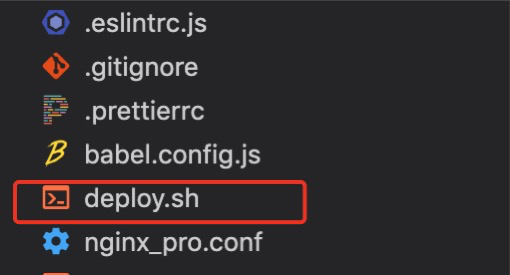

# git提交自动化脚本

## 前提
最近开发真是越来越懒了，git 提交每次 add -> commit ->push的都觉得挺烦的。尤其是经常在push之前还要执行pull。不得不说，这活真的是机械性的。那么机械性的工作就机械对待吧，怎么说程序员也不是机器啊，程序员别名IT开发者。

于是萌生了git 提交自动化的念头。其实原理也很简单，就是在终端（window是dos窗口）执行git命令嘛。无论是mac还是window，其实最终执行的都是shell命令。所以我们只需要在项目中添加一个shell脚本就行。

***deploy.sh***（名字随便取，后缀一定要是.sh，sh是shell脚本的固定后缀）



## 脚本开发
***deploy.sh*** 内容其实也很简单，就是普通的git命令
``` sh
git add -A

git commit -m '代码更新',

git pull

git push
```
脚本也有了，那么记下来就要在我们的项目中配置一个执行该脚本的命令。

``` json
// package.json
"scripts": {
  ...
  "deploy": "bash deploy.sh"
}

```
::: warning Tips
  这里要注意的是shell脚本要用 ***bash*** 来执行
:::

然后我们只需要在在控制台敲 ***npm run deploy*** 就会制动执行shell脚本中的git命令了，到这里基本功能就完成了；

但是，其实我们还可以加一点优化的，比如说在执行命令之前先检查一下git分支是否有需要提交的代码？如果不存在脚本执行终止，如果存在执行继续；

``` sh
# 打印git status, 查看当前分支的状态

# 抽取变动的文件名。并标注为新增或者删除和修改
status=`git status --porcelain`
#  判断是否有需要提交的内容
if [ -n "$status" ]
then
  echo "$status"
else
  echo '分支clean,无需提交的代码'
  exit 1
fi
......

```

嗯，到这里基本上大功告成了，正规的操作肯定是没有问题的，脚本可以顺畅的执行。

但是大家注意没有，上面我们的commit信息是固定的，这对于代码版本维护肯定不友好的，那么该怎么办呢？如果每次都要去修改脚本其实也是很费劲的。

所以，我首先想到的就是在脚本执行时，提示数据commit信息，然后将输入的信息拼接到git commit -m 后面。这样就达到了动态commit信息的效果了。其实到这里就对普通的前端来说与要求有点高了。因为shell脚本的编写一般是前端触及不到的，就不做过多赘述了，直接贴代码了。

``` sh
# 定义一个变量接收用户数据的文本
message=""
echo -n "请填写commit信息:"
while IFS= read -r -s -n1 char
do
    # 如果读入的字符为空，则退出 while 循环
    if [ -z $char ]
    then
        echo
        break
    fi
    # 如果输入的是退格或删除键，则移除一个字符
    if [[ $char == $'\x08' || $char == $'\x7f' ]]
    then
        [[ -n $message ]] && message=${message:0:${#message}-1}
        printf '\b \b'
    else
        message+=$char
        printf $char
    fi
done
# 执行commit提交

git commit -m "$message" 

```

嗯，到这里貌似都大功告成了，看起来也挺完美的了。但是其实还没有，别忘了在git commit 之后我们还要执行git pull命令。如果拉取的代码跟本地分支的代码冲突了怎么办呢？

有冲突就解决冲突啊，是的。所以在pull之后就不能直接push了，因为即使你的文件冲突了push也是可以成功的。因为冲突只能手动去解决，所以在pull之后我们只能暂停push，给到用户一个观察的时间。并提示用户是否需要将代码合并到远程分支。用户确认后执行下一步操作。

直接上代码，看看shell是如何实现对话框的：

``` sh
git pull

read -p "是否将代码push到远程分支? [Y/N] " input

case $input in
  [yY]*)
    echo "即将push代码到远程分支...."
    git push
    echo "代码已推送至远程分支！"
    ;;
  [nN]*)
    echo "代码提交到暂存区"
    exit
    ;;
  *)
    echo "仅能输入[yY]或者[nN]"
    ;;
esac
```
就是这么简单的，是不是很容易就学会了呢？

最后为大家附上完整源码：
``` sh
#! /bin/bash
# 抽取变动的文件名。并标注为新增或者删除和修改
branch=`git branch | grep \* | cut -d ' ' -f2`
echo "当前分支：$branch"
status=`git status --porcelain`
#  判断是否有需要提交的内容
if [ -n "$status" ]
then
  echo "$status"
else
  echo '分支clean,无需提交的代码'
  exit
fi
message=""
echo "开始执行git add ..."
git add -A

echo -n "请填写commit信息："
while IFS= read -r -s -n1 char
do
    # 如果读入的字符为空，则退出 while 循环
    if [ -z $char ]
    then
        echo
        break
    fi
    # 如果输入的是退格或删除键，则移除一个字符
    if [[ $char == $'\x08' || $char == $'\x7f' ]]
    then
        [[ -n $message ]] && message=${message:0:${#message}-1}
        printf '\b \b'
    else
        message+=$char
        printf $char
    fi
done

git commit -m "$message; 更新文件：$status" 
# 如果当前分支没有什么可提交的，commit命令将执行失败
if [ $? -eq 0 ]; then
    echo "success"
else
    echo "fail"
    exit 1
fi

git pull

function isCommit () {
    read -p "是否将代码push到远程分支? [Y/N] " input

    case $input in
    [yY]*)
        echo "即将push代码到远程分支...."
        git push
        ;;
    [nN]*)
        echo "代码提交到暂存区"
        exit
        ;;
    *)
        echo "仅能输入[yY]或者[nN]"
        isCommit
        ;;
    esac
}

isCommit

function isBuild () {
    read -p "是否需要构建项目？[Y/N]" build
    case $build in
        [yY]*)
            npm run build:all
            ;;
        [nN]*)
            exit
            ;;
        *)
            echo "仅能输入[yY]或者[nN]"
            isBuild
            ;;
    esac
}

if [ "$branch" = "develop" ]; then
    isBuild
fi
```
