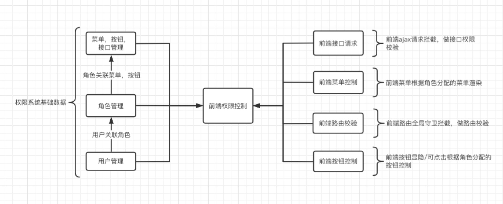

# 我是如何做前端权限管理

业务系统的开发权限控制是必不可少的。权限控制又分为前端权限，后段权限，接口权限和数据权限。

一般接口的权限和数据的权限都是由后段开发者来控制的。前端的权限控制范围一般在系统菜单，按钮以及前端请求上。权限设置及分配的流程一般都是通过人员关联角色，角色关联菜单，菜单关联按钮及接口：



上图描述了一个完整的系统权限管理所涉及的内容以及实现权限控制的技术实现。同时也可以看出，做一个业务系统的权限控制，还是需要做一部分基础配置工作的。这部分工作量是不可避免的。其中最为繁重的工作量其实就是在菜单按钮的录入工作以及按钮与接口关联工作。因为按钮显隐性/可点击行的控制主要根据按钮点击触发的接口请求来控制。所以需要建立按钮与接口的关联性，这也是一个不可避免的手工维护的工作。而且是一个长期的工作，只要项目还在开发或者迭代，这个工作基本是不可避免的。

其实讲到这里，本文的目的已经很明显了，其实就是节省前端权限维护的工作量的问题。

- 前端按钮，接口的录入工作
- 按钮与接口关联

## 权限控制指令(v-auth)

我们通过全局自定义指令来做我们的前端按钮控制。这里的前端按钮并不是狭义的Button，泛指一切可点击且会触发接口请求的elementNode。我们通过给这些按钮添加自定义的指令(v-auth)来控制接按钮可点击性。针对Button我们可以直接设置disabled属性。针对那些非Button该如何出呢？这里简单给大家介绍一个非常实用的css小技巧，来屏蔽元素的操作事件。

``` css
.custom_disabled {
  pointer-event: none;
  color: #DDD;
  opacity: 0.8;
}
```
***pointer-event:none;***

1. 阻止用户的点击动作产生任何效果
2. 阻止缺省鼠标指针的显示
3. 阻止CSS里的hover和active状态的变化触发事件
4. 阻止JavaScript点击动作触发的事件

接下来我们看一下我们的自定义指令

``` js
// v-auth， 首先我们采用的管理员角色登陆系统，拥有所有的接口和按钮权限,只要录入按钮和接口，就会立马被分配给管理员
export default {
  inserted(el, { value }, { context }) {
      // value 为v-auth接收的值，我这里是通过接口的url来做按钮和接口的关联的，所以value === url
      var store = context.$store
      // 用户登陆之后根据角色获取权限集合，存储在vuex中
      var authMap = store.getters.authMap
      // 判断用户权限是否存在该按钮的权限
      var hasAuth = authMap[value]
      if (!hasAuth) {
        if (el.tagName === 'BUTTON') {
          // 按钮禁用
          el.setAttribute('disabled', true)
        } else {
          // 其他元素添加禁用样式，阻止用户的点击动作产生任何效果
          el.classList.add('custom_disabled')
        }
        // 判断如果管理员没有该接口权限，执行添加权限操作
        var { path, name } = context.$route
        // 组合接口录入的参数
        var params = {
          auth: value,
          menu: path,
          menuName: name,
          name: nameZH
        }
        // 调用录入的方法
        window.AUTH_STORE.addAuth(params)
      }
      
    }
  }
}
```
## 利用指令录入接口
***window.AUTH_STORE*** 是接口录入的具体实现对象

``` js
import axios from 'axios'
import store from '../store/index.js'
// 导入更新用户权限的方法
import {getUsetMenuList} from '@/api/login.js'
class AuthStore {
  constructor () {
    // 等待录入的接口
    this.awaitCreateBtn = {}
    // 录入失败的接口
    this.cerateErrorBtn = {}
    this.timer = null
  }
  // 添加未上传的权限接口
  addAuth (params) {
    var code = params.auth.split('/').join('_)
    this.awaitCreateBtn[code] = params
    if (this.timer) {
      window.clearTimeout(this.timer)
      this.timer = null
    }
    this.timer = setTimeout(() => {
      this.implement()
    }, 1000)
  }
  //  执行添录入操作, 因为考虑录入失败的情况，这里我们采取递归来一个个的录入接口，我们需要捕获那些权限录入失败，并缓起来。
  implement () {
    var keys = Object.keys(this.awaitCreateBtn)
    if (!keys.length) {
      // 当前任务执行完成的时候，输出录入失败的权限
      console.log(this.cerateErrorBtn)
      return
    }
    var curKey = keys[0]
    var params = this.awaitCreateBtn[curKey]
    // 录入接口
    axios.post('/api/menu', params).then(async res => {
      if (res.data.code === 200) {
        //  删除authStore里的缓存
        this.deleteAuth(curKey)
        // 更新权限缓存
        await getMenuList()
        this.implement()
      }
    }).catch(e => {
      this.cerateErrorBtn[curKey] = params
    })
  }
  // 删除添加成功的auth
  deleteAuth (key) {
    if (this.awaitCreateBtn[key]) {
      delete this.awaitCreateBtn[key]
    }
  }
}
window.AUTH_STORE = new AuthStore()
```
通过以上代码，我们就可以简单的做到了接口自动录入了，在开发过程中可以大大的降低工作量。因为接口跟按钮的关联这部分工作量无法避免，所以，就只能利用在做这份工作的时候把我们的接口自动录入到系统中。

## 如何在axios做接口权限校验

axios已经前端开发的标配了，所以，我们可以通过对ajax的请求做拦截，来做接口的权限校验；判断接口是否存在，不存在则取消接口请求

``` js
import axios from 'axios'
import store from '@/store/store.js'
// 获取axios的CancelToken
const CancelToken = axios.CancelToken
const source = CancelToken.source()
const authMap = store.getters.authMap
var $http = axios.create()
$http.interceptors.request.use((config) => {
  // 给每个请求添加唯一标示
  config.cancelToken = source.token
  // 判断如果接口不存在，取消请求
  if (!authMap[config.url]) {
    source.cancel()
  }
})

```

